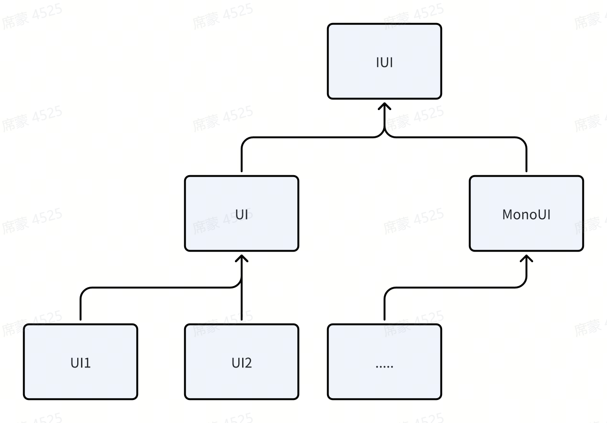

Unity核心层主要实现了一些C#核心层的扩展接口，用于扩展功能，并触发核心层的接口和生命周期

**1.** **基础类扩展**

框架入口Init

```c#
public class Init : MonoBehaviour
{
  void Awake() { Core.Init(); } //框架初始化
  void Start() { Core.Start(); } //框架启动
  void Update() { Core.Trigger<IUpdater>(); } //触发更新生命周期
  void OnFocus() { Core.Trigger<IOnFocus>(); } //触发获得焦点生命周期
  ...
}
```

**2.** **存档扩展**

实现了IArchiveUtilityHelper接口可以将文本存档(csv, json)存入Unity的PlayerPrefs中，可自由配置是否启用。

**3.** **资源扩展**

实现了几个资源辅助器

AddressablesHelper:加载Addressables打包的资源

ResourcesHelper:加载Resources下的资源

SpriteAtlasModule:加载图集中的纹理资源

**4.** **序列化扩展**

实现了Json和Csv的序列化辅助器，其中Csv增加了类型扩展，并且定义了表结构

| #(注释)  |      |        |           |
| -------- | ---- | ------ | --------- |
| #P(属性) | Id   | Name   | Prop1     |
| #T(类型) | int  | string | List<int> |
|          | 1    | test   | 1,2,3     |

其中类型行中类型可通过CsvSerializeHelper.ITypeHandler扩展，例如上表的List<int>，最终数据可序列化为

```c#
class Test
{
  int Id;
  string Name;
  List<int> Prop1;
}
```

**5.** **UI****模块**



**6.** **音效模块**

提供了音效的播放和停止

**7.** **控制台模块**